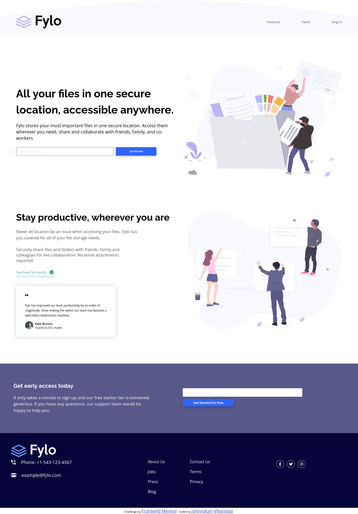
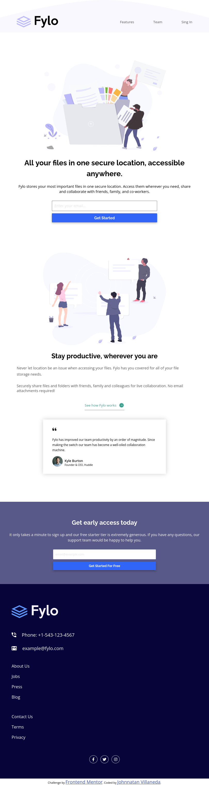
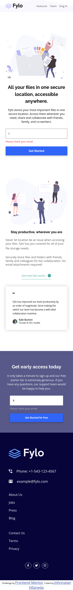

# Frontend Mentor - Fylo landing page with two column layout solution

This is a solution to the [Fylo landing page with two column layout challenge on Frontend Mentor](https://www.frontendmentor.io/challenges/fylo-landing-page-with-two-column-layout-5ca5ef041e82137ec91a50f5). Frontend Mentor challenges help you improve your coding skills by building realistic projects.

## Table of contents

- [Overview](#overview)
  - [The challenge](#the-challenge)
  - [Screenshot](#screenshot)
  - [Links](#links)
- [My process](#my-process)
  - [Built with](#built-with)
- [Author](#author)

## Overview

### The challenge

Users should be able to:

- View the optimal layout for the site depending on their device's screen size
- See hover states for all interactive elements on the page

### Screenshot

### Links

- Solution URL: [Github Repository](https://github.com/JohnnatanV/fylo-landing-page)
- Live Site URL: [Vercel Live Page](https://fylo-landing-page-iota-nine.vercel.app/)

## My process

### Built with

- Semantic HTML5 markup
- CSS custom properties
- Flexbox
- CSS Grid
- Mobile-first workflow

## Author

- Website - [Johnnatan Villaneda](https://github.com/JohnnatanV)
- Frontend Mentor - [@JohnnatanV](https://www.frontendmentor.io/profile/JohnnatanV)
- Twitter - [@JohnnatanV](https://twitter.com/JohnnatanV)
